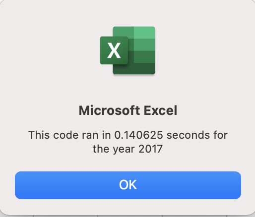
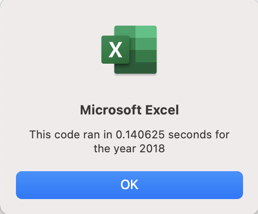

# VBA Challenge
## Overview of Project
### Purpose: 
 The client wants to invest in Daqo's stock. Before investing in it they would like to expand the dataset to include the entire stock market over 2017 and 2018 years. All Stocks Analysis VBA script needs to be refactored. 

## Analysis 
  I have measured “All Stocks Analysis” original script performances for two years before refactoring it. 
 The script performance ran 0.59375 seconds for the 2017 year: 

 The script performance ran 0.609375 seconds for the 2018 year: 

 I followed a prepared code structure from VBA_Challenge.vbs. 
 Next step was refactoring the VBA code in order to make the new code more efficient (fewer steps, less memory, easier to read). 
 Please see below the refactored loops: 

 I have measured new performance results.  
 Refactored script performance ran 0.140625 seconds for the 2017 year: 

 Refactored script performance ran 0.140625 seconds for the 2018 year: 

## Results
 The refactored code runs faster by 0.23 seconds in 2017 and 2018. 
 I compared All Stocks “Return” results in 2017 and 2018. 

 In 2017 almost all 12 tickers went up in return by minimum 5%, maximum 199.4% except ticker: TERP. It went down by 7.2%.    
 
 In 2018 you can see a different situation, when most of tickers had negative return except two tickers ENPH and RUN. 
 
 Daqo Stock had a high return 199.4% with 35,796.200 total daily volume in 2017. However, in 2018 it had -62.6% in return with 107,873.900 total daily volume. As a result, it is not best to time for the client to invest in the stock when return result is negative. 

## Summary
 Advantages of refactoring a code are the faster performance, clear code that easy to read, and an opportunity to work properly with thousands of stocks. 
 Disadvantages of refactoring a code are cost, risks and working with bugs. 
 The benefits of refactored VBA scrip are: 
-	The speed of performance is faster by 0.23 seconds. 
-	The code is easier to understand for future users
-	Helps to find bags
-	Find new ways to write a code

 The weaknesses of refactored VBA script are: 
- Fix bugs
-	Extra time 
-	Extra cost

